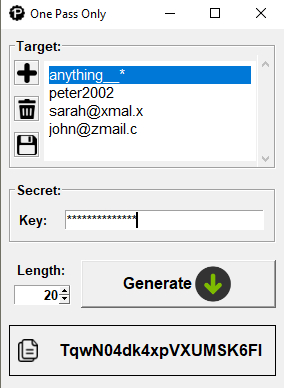

# onepassonly v0.1

**OnePassOnly** app is a simple solution for securely generating and managing your passwords. 
With **OnePassOnly**, you can easily create unique and complex passwords for all of your online accounts, without the hassle of remembering them all but the only the one you consider it's easier to remember.

The app works by taking a <i>**Target**</i>, such as login name and domain of the target account e.g. <i>johndow@xmail.org</i>, and combining it with a unique <i>**Secret**</i> provided by you. 
This combination generates a password that is both strong and unique. It ensures also that every time you use the same target and secret you get the same password.

Also allows you to store and manage all of your <i>Target</i> in your local machine. 




Run the app:
```python
import opogui
 
app = opogui.OPOGui()
app.run()
```
### Modules
Uses [Pillow 9.4.0](https://pypi.org/project/Pillow/) to load the images.
```commandline
pip install pillow
```
```commandline
conda install -n myenv pillow
```
